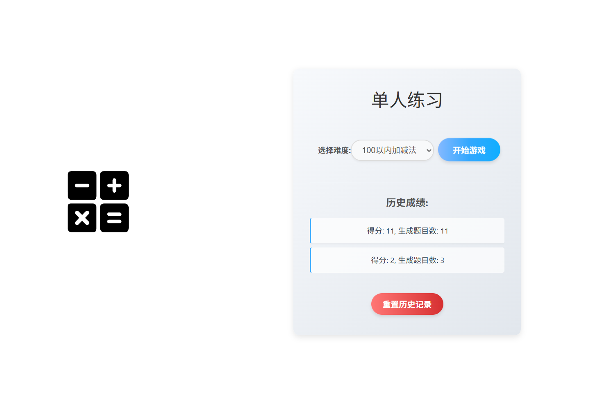
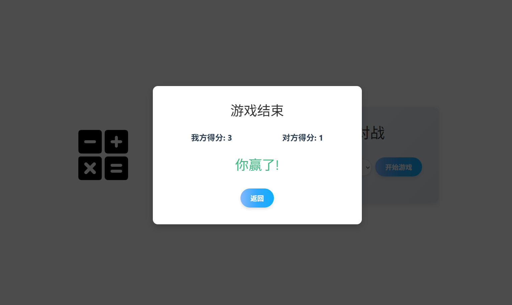

<p align="center">
  
</p>

# Arithma Battle

基于Vue.js的心算竞技场 | 实时对战PK × 渐进式训练

✓ 成绩追踪 

📊 使用Vue.js构建的网页端数学训练平台，融合游戏化设计，支持多难度级别、排行榜、响应式布局，适合教育与娱乐场景。

🚀 通过组件化开发实现高效交互，后续计划扩展社交分享与成就系统。

## 项目概述

ArithmaBattle 是一款基于网页的交互式心算训练与竞技平台，旨在通过趣味PK模式和单机练习模式提升用户的计算速度和数学能力。

### 核心功能：

- 实时对战模式（支持加减乘除运算）
- 多难度级别适应不同年龄段用户
- 成绩追踪系统记录进步轨迹
- 响应式设计适配各种设备

### 项目特色：
- ✓ 将数学练习与游戏对战完美结合
- ✓ 单人训练与多人PK双模式
- ✓ 竞技机制激发学习动力
- ✓ 简洁直观的用户界面
- ✓ 适合课堂教学或家庭娱乐

无论是想提升计算能力的学生，还是喜欢数字游戏的爱好者，都能在这里找到挑战乐趣。

## 在线演示

[](https://ab.co1d.in)

上述链接为演示部署版本。

## 技术栈

- 前端框架：Vue.js
- UI组件：自定义组件
- 状态管理：Vuex
- 路由管理：Vue Router
- 构建工具：Vite
- CSS预处理：SCSS/LESS
- 响应式设计：Flexbox/Grid

## 安装与运行

### 前提条件
- Node.js (v14.0+)
- npm 或 yarn

### 安装步骤

```bash
# 克隆仓库
git clone https://github.com/Coldin04/ArithmaBattle.git

# 进入项目目录
cd ArithmaBattle

# 安装依赖
yarn install

# 启动开发服务器
yarn dev
```

### 构建生产版本

```bash

yarn build
```

## 项目结构

```
ArithmaBattle/
├── public/              # 静态资源目录
│   ├── favicon.ico      # 网站图标
│   └── index.html       # HTML入口文件
├── src/                 # 源代码目录
│   ├── assets/          # 资源文件(图片、音效等)
│   ├── components/      # 组件目录
│   │   ├── common/      # 通用组件
│   │   │   ├── Button.vue
│   │   │   └── Modal.vue
│   │   ├── game/        # 游戏相关组件
│   │   │   ├── ProblemDisplay.vue   # 数学题目显示
│   │   │   ├── Timer.vue            # 计时器组件
│   │   │   ├── ScoreBoard.vue       # 得分板组件
│   │   │   └── AnswerInput.vue      # 答案输入组件
│   │   └── layout/      # 布局组件
│   │       ├── Header.vue
│   │       └── Footer.vue
│   ├── views/           # 页面视图组件
│   │   ├── Home.vue     # 首页
│   │   ├── Practice.vue # 练习模式
│   │   ├── Battle.vue   # 对战模式
│   │   ├── Profile.vue  # 用户资料
│   │   └── Leaderboard.vue # 排行榜
│   ├── router/          # 路由配置
│   │   └── index.js
│   ├── store/           # Vuex状态管理
│   │   ├── index.js
│   │   └── modules/     # 状态模块
│   │       ├── game.js
│   │       └── user.js
│   ├── styles/          # 全局样式文件
│   │   ├── variables.scss
│   │   └── global.scss
│   ├── utils/           # 工具函数
│   │   ├── arithmetic.js  # 数学运算生成
│   │   └── storage.js     # 本地存储处理
│   ├── App.vue          # 根组件
│   └── main.js          # 应用入口
├── .gitignore           # Git忽略配置
├── package.json         # 项目依赖与脚本
├── vite.config.js       # Vite配置
└── README.md            # 项目说明文档
```

## 功能展示





## 贡献指南

欢迎对ArithmaBattle项目做出贡献！请按照以下步骤参与：

1. Fork本仓库
2. 创建您的特性分支 (`git checkout -b feature/AmazingFeature`)
3. 提交您的更改 (`git commit -m 'Add some AmazingFeature'`)
4. 推送到分支 (`git push origin feature/AmazingFeature`)
5. 开启一个Pull Request

## 开发计划

- [ ] 添加更多数学运算类型（如指数、开方等）
- [ ] 实现多人在线对战房间
- [ ] 添加成就系统
- [ ] 开发移动应用版本
- [ ] 支持自定义题目难度

## 许可证

本项目采用MIT许可证 - 查看[LICENSE](LICENSE)文件了解详情

## 联系方式

项目维护者: Coldin04 - https://co1d.in

项目链接: [https://github.com/yourusername/ArithmaBattle](https://github.com/Coldin04/ArithmaBattle)

